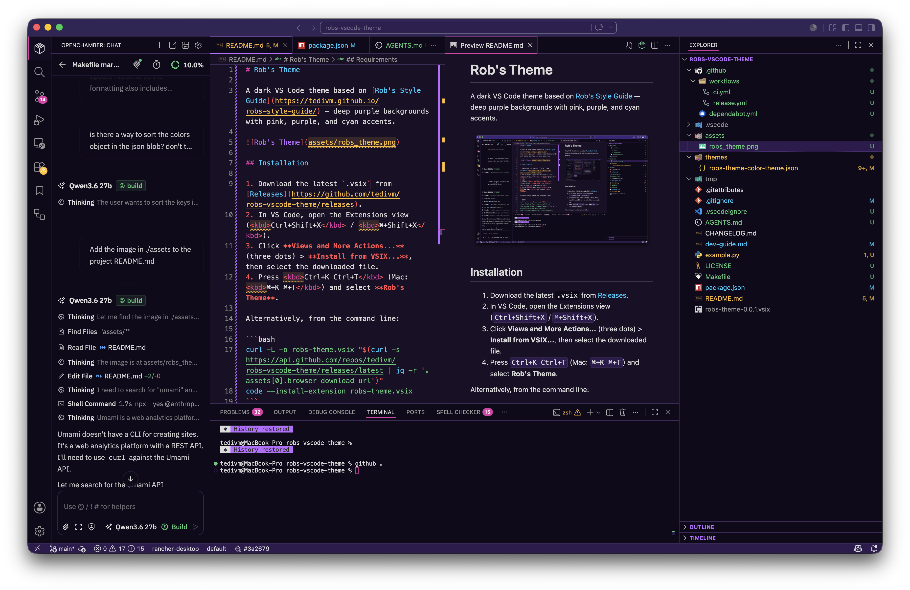

# Rob's Theme

A dark VS Code theme based on [Rob's Style Guide](https://tedivm.github.io/robs-style-guide/) — deep purple backgrounds with pink, purple, and cyan accents.



## Installation

1. Download the latest `.vsix` from [Releases](https://github.com/tedivm/robs-vscode-theme/releases).
2. In VS Code, open the Extensions view (<kbd>Ctrl+Shift+X</kbd> / <kbd>⌘+Shift+X</kbd>).
3. Click **Views and More Actions...** (three dots) > **Install from VSIX...**, then select the downloaded file.
4. Press <kbd>Ctrl+K Ctrl+T</kbd> (Mac: <kbd>⌘+K ⌘+T</kbd>) and select **Rob's Theme**.

Alternatively, from the command line:

```bash
curl -L -o robs-theme.vsix "$(curl -s https://api.github.com/repos/tedivm/robs-vscode-theme/releases/latest | jq -r '.assets[0].browser_download_url')"
code --install-extension robs-theme.vsix
```

## Requirements

- VS Code 1.120.0 or later
